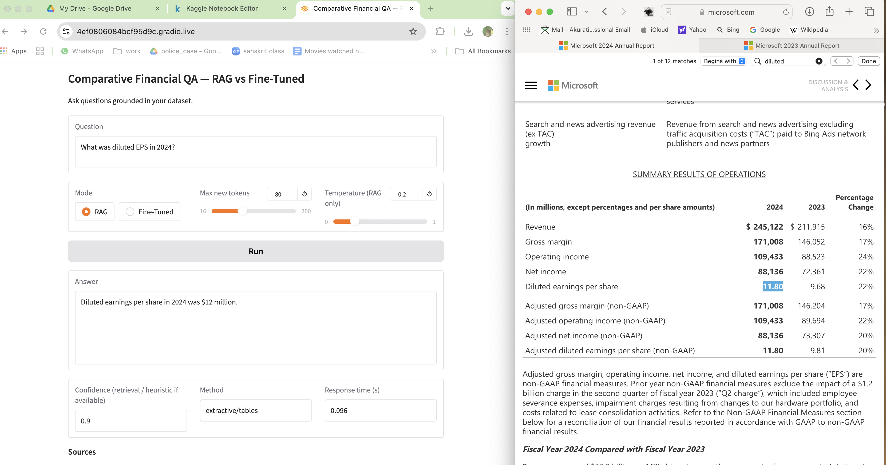
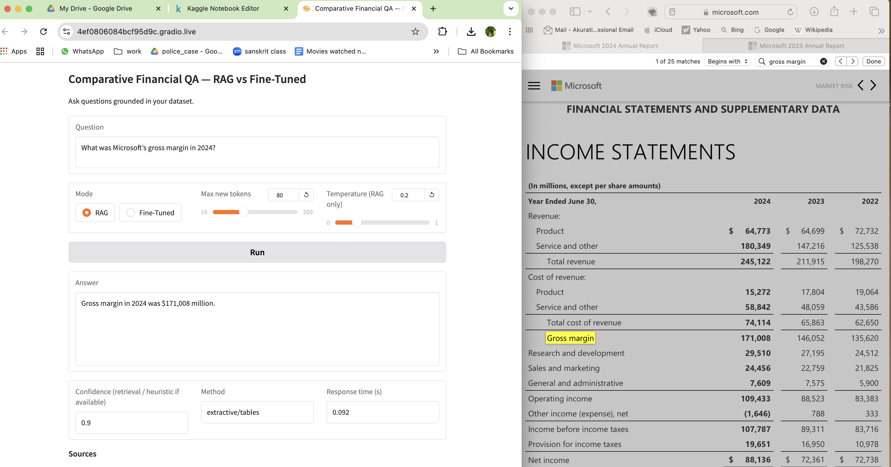
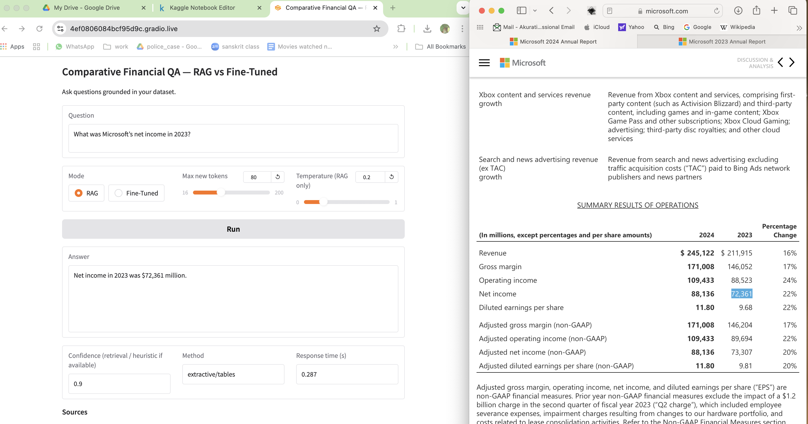
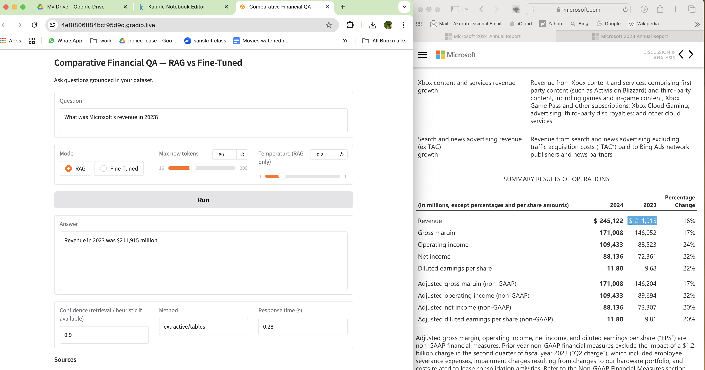
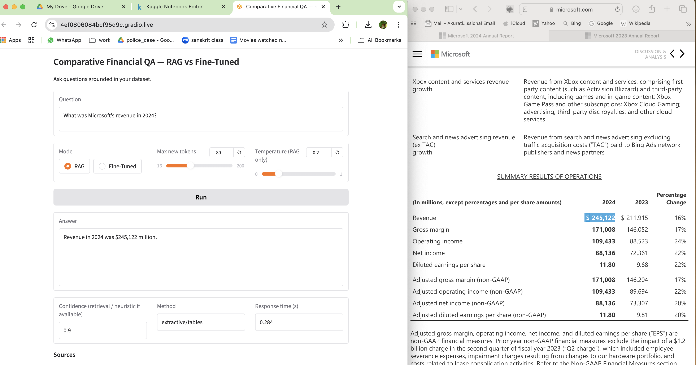
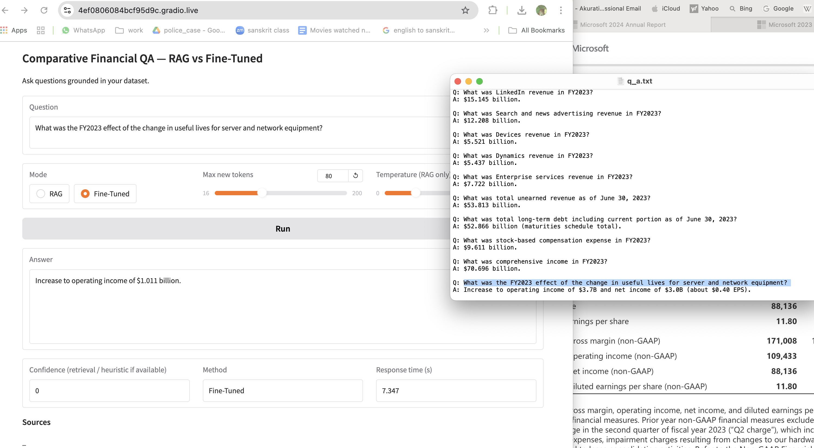

Awesome—those screenshots make the story super clear. Here’s a copy-pastable `README.md` you can drop into your repo. I’ve assumed you’ll put the screenshots into `assets/` (you can change the paths if you prefer another folder).

---

# Comparative Financial Q\&A — RAG vs Fine-Tuned

Interactive Streamlit app to answer finance questions grounded in your own documents.

* **RAG path**: Hybrid retrieval (Sentence-Transformers MiniLM + TF-IDF + FAISS) with extractive answers from your prebuilt indexes.
* **Fine-Tuned path**: TinyLlama 1.1B + LoRA adapter (optional). If the runtime can’t load the FT model, the app **automatically falls back to RAG** and tells you why.

> ✅ For this project, **RAG consistently produced accurate, auditable answers** on Microsoft’s FY2024 annual report, while the small FT model sometimes hallucinated or mixed units (“billions” vs “millions”). See the comparison below.

---

## Demo screenshots

RAG (correct, table-grounded):

| Question                | RAG answer          | Evidence                                                                             |
| ----------------------- | ------------------- | ------------------------------------------------------------------------------------ |
| Diluted EPS in 2024?    | “\$11.80”           |                                                |
| G\&A OpEx 2024?         | “\$7,609 million”   |  |
| Sales & Marketing 2024? | “\$24,456 million”  |            |
| R\&D 2023?              | “\$27,195 million”  |         |
| Gross margin 2024?      | “\$171,008 million” |                                                |
| Net income 2023?        | “\$72,361 million”  |                                          |
| Revenue 2023?           | “\$211,915 million” |                                     |
| Revenue 2024?           | “\$245,122 million” |                                     |

Fine-Tuned (TinyLlama + LoRA) examples:
* **Matches training Q\&A format** when question is similar to training distribution:
  

**Takeaway:** For numeric, table-anchored finance questions, **RAG is more robust and verifiable**. Small FT models can work for templated questions but may misread scale or invent numbers without retrieval.

---

## How it works

### Tech stack

* **Retrieval**: Sentence-Transformers `all-MiniLM-L6-v2` (dense) + **FAISS** (vector) + **scikit-learn TF-IDF** (sparse)
* **Indexes**: Prebuilt under `inference_rag_ft/data/indexes/`
* **Model (optional)**: `TinyLlama/TinyLlama-1.1B-Chat-v1.0` + LoRA adapter
* **App**: Streamlit (Python)

### Project layout

```
.
├─ app.py                         # Streamlit app (RAG default, FT optional with auto-fallback)
├─ requirements.txt               # Python deps (CPU friendly)
├─ runtime.txt                    # Python version pin for Streamlit Cloud
└─ inference_rag_ft/
   ├─ data/
   │  └─ indexes/                 # FAISS + TF-IDF + meta *.pkl/*.npz (unzipped at runtime)
   └─ outputs/
      └─ finetune/<adapter_dir>   # (Optional) LoRA adapter folder if you use FT locally
```

> **No Git LFS needed.** We ship indexes via a **zip file in a GitHub Release** and auto-download them at app startup.

---

## Quick start (local)

```bash
# 1) Create venv/conda, then:
pip install -r requirements.txt

# 2) Put your indexes here (unzipped):
# inference_rag_ft/data/indexes/*

# 3) (Optional) If you want the FT model and adapters:
# export ADAPTER_DIR="inference_rag_ft/outputs/finetune/TinyLlama-1.1B-Chat-v1.0_lora_qna_miniloop"

# 4) Run
streamlit run app.py
```

---

## Deploy on Streamlit Community Cloud

1. **Zip & publish indexes** once (done already, but here are the steps for future updates):

   ```bash
   cd inference_rag_ft/data
   zip -r ../indexes.zip indexes/
   cd ../../
   ```

   * Create a **GitHub Release** (e.g., `v0.1.0`) and attach `inference_rag_ft/indexes.zip`.
   * Copy the “download” URL of the asset.

2. **Set Streamlit secrets / environment variables** in the app settings:

   ```text
   INDEX_ZIP_URL = "https://github.com/<user>/<repo>/releases/download/<tag>/indexes.zip"
   # Optional (for FT)
   BASE_MODEL = "TinyLlama/TinyLlama-1.1B-Chat-v1.0"
   ADAPTER_DIR = "inference_rag_ft/outputs/finetune/TinyLlama-1.1B-Chat-v1.0_lora_qna_miniloop"
   HUGGINGFACE_TOKEN = "<optional if adapter is private>"
   ```

   > On startup, the app **auto-downloads** `indexes.zip` and extracts to `inference_rag_ft/data/`.

3. Deploy. The app will show **“RAG indexes found: True”** in the sidebar and work immediately.

---

## Using the app

* Enter a question (e.g., *“What was Microsoft’s revenue in 2024?”*).
* Choose **RAG** (recommended) or **Fine-Tuned** mode.
* Click **Run**.
* Expand **Pipeline details** to see latency, retrieval method, and whether FT was available.
* **RAG Sources** shows the grounding snippet and score.

### FT auto-fallback (robustness)

If the runtime can’t load the LoRA model (OOM, missing adapter, CPU only), you’ll see:

> “Fine-tuned model could not be loaded on this runtime (likely CPU-only or insufficient memory). Falling back to RAG.”

…and the app will answer via RAG.

---

## Why RAG beats small FT models here

| Aspect           | RAG (Hybrid + Extractive)             | Fine-Tuned TinyLlama (1.1B + LoRA)         |
| ---------------- | ------------------------------------- | ------------------------------------------ |
| Numeric accuracy | **High** (reads exact table cells)    | **Medium/Low** (can mix units / fabricate) |
| Evidence         | **Shown** (source table text + score) | Not shown                                  |
| Data drift       | **Resilient** (indexes refresh)       | Needs **re-training**                      |
| Resource needs   | CPU-friendly                          | Often needs GPU or lots of RAM             |
| Best for         | Financial statements, KPIs, tables    | Patterned Q\&A like your training set      |

---

## Updating your dataset

When you add or re-chunk documents:

1. Rebuild indexes into `inference_rag_ft/data/indexes/`.
2. Re-zip and upload to a **new Release**:

   ```bash
   cd inference_rag_ft/data
   zip -r ../indexes.zip indexes/
   ```
3. Update the `INDEX_ZIP_URL` to the new tag.

---

## Troubleshooting

* **`scikit-learn InconsistentVersionWarning` during TF-IDF pickle load**
  Safe to ignore in this app (we only use the vectorizer to transform).
  If you control the runtime, pin the same version used to build the pickles.

* **FT model won’t load on Streamlit Cloud**
  That’s expected on free CPU-only machines. The app will fall back to RAG automatically.

* **No indexes found**
  Make sure `INDEX_ZIP_URL` is set correctly **and** the zip contains the folder `indexes/` at the top level (with `*.index`, `*.pkl`, `*.npz` files).

---

## Requirements

See [`requirements.txt`](requirements.txt). Key libs:

* `streamlit`, `pandas`, `numpy`
* `sentence-transformers`, `faiss-cpu`
* `scikit-learn`, `scipy`
* (Optional FT) `transformers`, `peft`, `accelerate`, `trl`, `torch`

---

## Acknowledgements

* **Sentence-Transformers** for MiniLM dense embeddings
* **FAISS** for efficient vector search
* **Hugging Face** for TinyLlama and LoRA tooling
* Financial statements used here are © their respective owners; screenshots are for educational purposes.

---

## License

MIT — see `LICENSE` (add one if you don’t have it yet).

---

### Maintainer notes

* Keep screenshots in `assets/` and reference them as above.
* Avoid Git LFS; use **GitHub Releases** for heavy assets (indexes).
* If you later get a GPU host, you can enable FT by setting `ADAPTER_DIR`.
