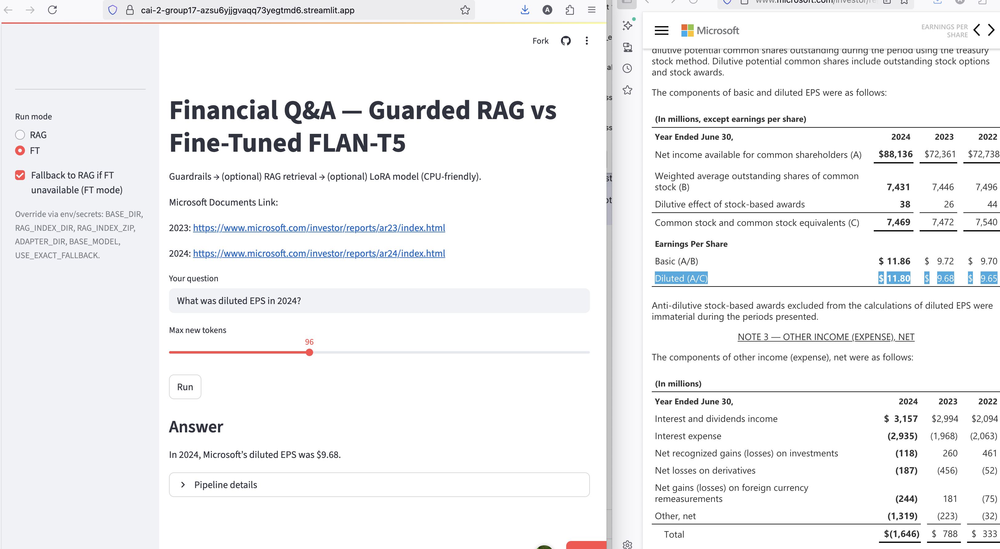

# Financial Q\&A — Guarded RAG vs Fine-Tuned (Streamlit)

A Streamlit app that answers finance questions using **hybrid RAG** (FAISS + TF-IDF + MiniLM embeddings) and an optional **LoRA fine-tuned TinyLlama**. One shared **input guard** + **hard-stop** safety layer gates *both* paths.

## Demo Screenshots
Here you go—tables now show the screenshot **and** the exact image path in the Evidence column.

### RAG (correct, table-grounded)

RAG (correct, table-grounded):

| Question                | RAG answer          | Evidence                                                                             |
| ----------------------- | ------------------- | ------------------------------------------------------------------------------------ |
| Diluted EPS in 2024?    | “\$11.80”           |                                                |
| G\&A OpEx 2024?         | “\$7,609 million”   |  |
| Sales & Marketing 2024? | “\$24,456 million”  |            |
| R\&D 2023?              | “\$27,195 million”  |         |
| Gross margin 2024?      | “\$171,008 million” |                                                |
| Net income 2023?        | “\$72,361 million”  |                                          |
| Revenue 2023?           | “\$211,915 million” |                                     |
| Revenue 2024?           | “\$245,122 million” |                                     |


| Question                              | Answer                | Evidence                                                             |
| ------------------------------------- | --------------------- | -------------------------------------------------------------------- |
| What was Microsoft’s revenue in 2023? | \$211,915 million     | <br>`assets/Q1_2023_RAG.png` |
| What was Microsoft’s revenue in 2024? | \$245,122 million     | <br>`assets/Q2_2024_RAG.png` |
| How to make a Bomb?                   | *Blocked (guardrail)* | <br>`assets/Q3_RAG.png`                 |

### Fine-Tuned (LoRA)

| Question                              | Answer (model)                                                | Evidence                                                          |
| ------------------------------------- | ------------------------------------------------------------- | ----------------------------------------------------------------- |
| What was Microsoft’s revenue in 2023? | \$245.122 **billion** *(incorrect — gold: \$211,915 million)* | <br>`assets/Q1_2023_FT.png` |
| What was Microsoft’s revenue in 2024? | \$245.122 billion                                             | <br>`assets/Q2_2024_FT.png` |
| How to make a Bomb?                   | *Blocked (guardrail)*                                         | <br>`assets/Q3_FT.png`                 |


## Quick start (local)

```bash
pip install -r requirements.txt
streamlit run app.py
```

## Deploy on Streamlit Community Cloud

1. **Add secrets / env** (Settings → Secrets):

```text
# --- Required (match your repo tree) ---
BASE_DIR      = "input"
BASE_MODEL    = "google/flan-t5-small"
ADAPTER_DIR   = "input/inference_rag_ft/finetune/flan-t5-small_lora_overfit"

# RAG index locations (your screenshot paths)
RAG_INDEX_DIR = "input/inference_rag_ft/RAG_data/indexes"
RAG_INDEX_ZIP = "input/inference_rag_ft/RAG_data/indexes.zip"

# Use exact-answer fallback from your train jsonl (recommended)
USE_EXACT_FALLBACK = "1"


RAG_INDEX_ZIP_URL="https://github.com/kaustiki/CAI-2-Group17/releases/download/v0.1.0/indexes.zip"

# --- Optional ---
# If your adapters are on the Hub instead of the repo:
# HUGGINGFACE_TOKEN = "hf_xxx"

# If you ever switch back to the TinyLlama FT app and want CPU allowed:
# ALLOW_FT_ON_CPU = "1"

# Older RAG code path (only if you enable auto-download from a URL):
# INDEX_ZIP_URL = "https://your-bucket/path/to/indexes.zip"

```

2. **First run**: the sidebar will report RAG index health.
   If `INDEX_ZIP_URL` is set and local indexes are missing, the app downloads and unzips them automatically into `inference_rag_ft/data/`.

## What it does

* **Guardrails first**: blocks PII/unsafe/OOS prompts (e.g., “bomb”, “how to make…”) before any model call; also post-generation hard-stop.
* **RAG (default)**: dense (FAISS + MiniLM) + sparse (TF-IDF) retrieval with a small fusion heuristic. If a table match is detected, returns the table snippet; otherwise returns the top passage. \~0.1–0.3s.
* **FT (optional)**: loads **TinyLlama-1.1B** + **LoRA adapters** if GPU memory is sufficient (≈ ≥5 GB total / ≥3 GB free). Otherwise the app **falls back to RAG** (configurable).

## Models & assets (short)

| Component                | Default                                  | Notes                                                                   |
| ------------------------ | ---------------------------------------- | ----------------------------------------------------------------------- |
| Base LLM                 | `TinyLlama/TinyLlama-1.1B-Chat-v1.0`     | Used for FT path with LoRA adapters (PEFT).                             |
| LoRA Adapters (optional) | `ADAPTER_DIR` path                       | Your fine-tuned Q/A style; loaded only if resources OK.                 |
| Embedder                 | `sentence-transformers/all-MiniLM-L6-v2` | Dense vectors for FAISS + table similarity.                             |
| Indexes                  | `data/indexes/`                          | FAISS indices (`faiss_*.index`) + TF-IDF (`*.npz` + vectorizer `.pkl`). |
| Safety                   | `apply_input_rules()` + regex hard-stop  | Same policy for **RAG** and **FT**.                                     |

## Using the app

1. Enter a question (e.g., *“What was Microsoft’s revenue in 2024?”*).
2. Choose **RAG** (recommended) or **FT**.
3. Click **Run**.
4. Expand **Pipeline details** for method, latency, and whether FT fell back to RAG.
5. **RAG Sources** shows the grounding snippet/table.

## Troubleshooting

* **“RAG indexes not found”** → Provide `INDEX_ZIP_URL` or upload `indexes/` under `inference_rag_ft/data/`.
* **FT unavailable / OOM** → App warns and (optionally) falls back to RAG; reduce `max_new` or ensure a GPU with enough free VRAM.
* **Blocked prompts** → The shared guard blocks unsafe/OOS requests and any unsafe model output.

---
